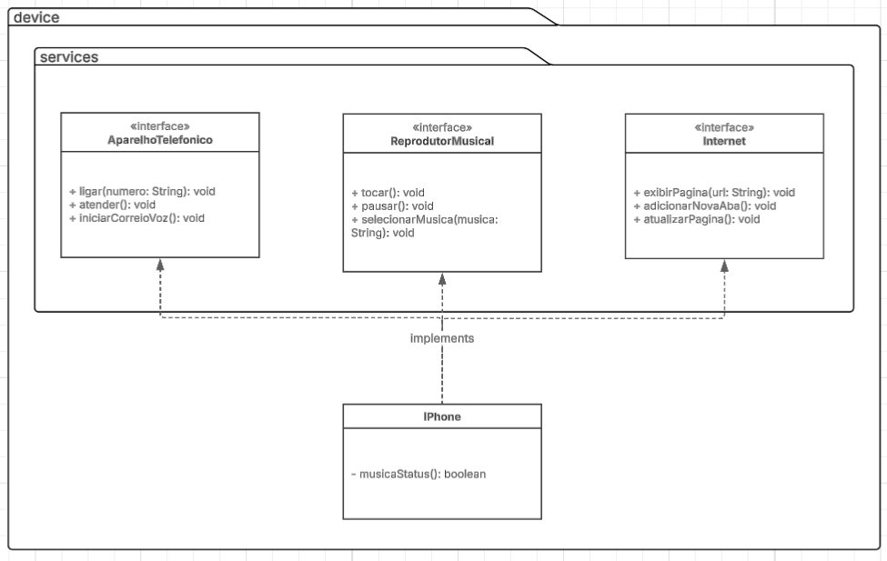

# Modelagem iPhone

#### Autor  
- [Guilherme Flyan](https://github.com/GFlyan)

Neste desafio da trilha de Java Básico da [DIO](https://www.dio.me), coloquei em prática os conceitos de Programação Orientada a Objetos (POO) modelando as funcionalidades principais de um iPhone, com base no vídeo oficial de lançamento de 2007.

### Cenário Desenvolvido

1. Modelei um **diagrama UML** representando um iPhone com três principais funcionalidades:
   - **Reprodutor Musical**
   - **Aparelho Telefônico**
   - **Navegador na Internet**

2. Cada funcionalidade foi representada através de **interfaces** com métodos específicos.
3. Implementei uma classe `iPhone` que **herda todas essas interfaces**, simulando o comportamento completo de um dispositivo inteligente.

###### Revisei os conceitos de abstração, interfaces e implementação de métodos em Java

| Funcionalidade        | Métodos                                 |
|-----------------------|-----------------------------------------|
| Reprodutor Musical    | `tocar()`, `pausar()`, `selecionarMusica(String musica)` |
| Aparelho Telefônico   | `ligar(String numero)`, `atender()`, `iniciarCorreioVoz()` |
| Navegador na Internet | `exibirPagina(String url)`, `adicionarNovaAba()`, `atualizarPagina()` |

###### Também pratiquei a criação de diagramas UML com LucidChart

### Diagrama UML

Ao final, o sistema simula um iPhone interagindo com músicas, chamadas e navegação na internet  .
